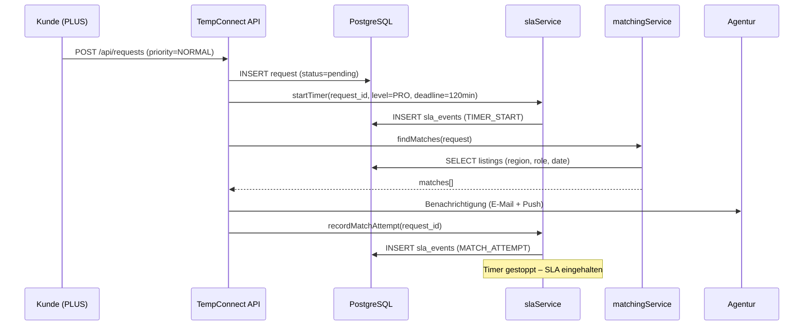
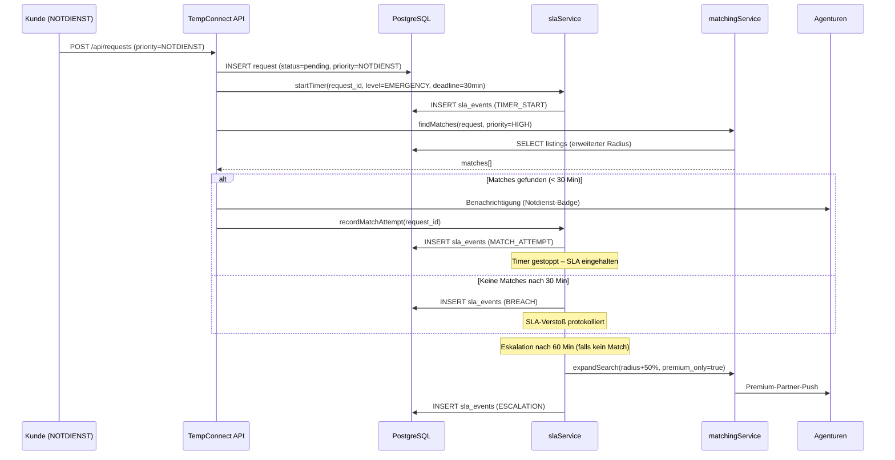
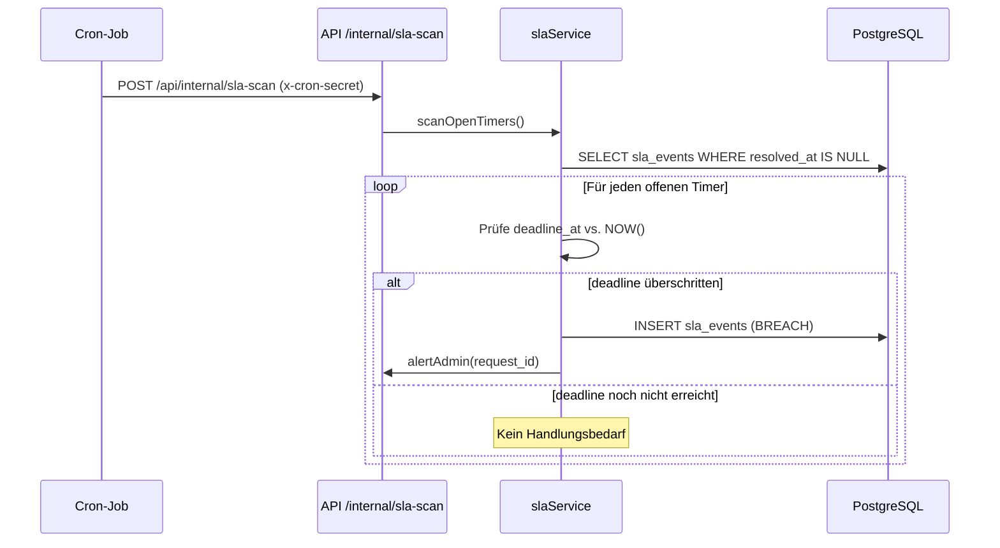

# TempConnect – Architektur (Hybrid-SLA Modell C)

Stand: 03.03.2026

---

## 1. Systemübersicht

TempConnect ist eine Docker-basierte Plattform zur Vermittlung von Zeitarbeitskapazitäten. Die Architektur folgt dem Hybrid-SLA-Modell C: Kunden mit FREE/BASIS-Tarif nutzen die einfache Marketplace-Suche (Best-Effort), während PLUS/NOTDIENST-Kunden über das Enterprise-Dashboard Zugang zu SLA-geschützten Features erhalten.

### Komponenten

```
┌─────────────────────────────────────────────────────────┐
│                      Reverse Proxy                       │
│                    nginx (Port 80/443)                    │
│  ┌─────────────┐  ┌────────────┐  ┌──────────────────┐  │
│  │ /           │  │ /api/*     │  │ /health          │  │
│  │ → Frontend  │  │ → API      │  │ → API /health    │  │
│  └─────────────┘  └────────────┘  └──────────────────┘  │
└─────────────────────────────────────────────────────────┘
         │                  │
         ▼                  ▼
┌─────────────┐     ┌──────────────┐     ┌───────────┐
│  Frontend   │     │   API        │────▶│  Redis    │
│  (Static)   │     │  (Node.js)   │     │  (Cache)  │
│  Port 80    │     │  Port 3000   │     │  Port 6379│
└─────────────┘     └──────┬───────┘     └───────────┘
                           │
                           ▼
                    ┌──────────────┐     ┌───────────┐
                    │  PostgreSQL  │     │  Mailpit  │
                    │  (Daten)     │     │  (Dev-Mail)│
                    │  Port 5432   │     │  Port 1025│
                    └──────────────┘     └───────────┘
```

---

## 2. Service-Architektur (API)

### 2.1 Kernservices

- **authService.js** – Registrierung, Login, JWT, Session-Management
- **userService.js** – Profil, Plan-Verwaltung, DSGVO-Export, `PLAN_LIMITS`
- **listingService.js** – Kapazitätsangebote (CRUD, Suche, Verfügbarkeit)
- **requestService.js** – Personalanfragen (Erstellen, Status, Zuordnung)
- **matchingService.js** – Matching-Engine (Region, Rolle, Datum, Scoring)
- **ratingService.js** – Bewertungssystem (Sterne, Subdimensionen)
- **searchService.js** – Marketplace-Suche (alte Suche für FREE/BASIS)

### 2.2 SLA-Services (Enterprise)

- **slaService.js** – Pulse-Timer, Breach-Erkennung, Event-Protokollierung
- **complianceService.js** – Compliance-Ampel, Policy-Prüfung
- **supplierMetricsService.js** – Supplier Scorecard, Performance-Metriken

### 2.3 Cron-Endpoints (intern)

```
POST /api/internal/sla-scan                  → Pulse-Timer prüfen, Breaches erkennen
POST /api/internal/recompute-supplier-metrics → Supplier-Scores neu berechnen
POST /api/internal/recompute-compliance       → Compliance-Status aktualisieren
```

Geschützt durch `INTERNAL_CRON_SECRET` (Header: `x-cron-secret`).

---

## 3. Datenmodell (SLA-relevant)

### 3.1 Tabellen

```
users
  ├── id, role, email, company_name, ...
  └── ← subscriptions (plan: FREE|BASIS|PLUS|NOTDIENST)

requests
  ├── id, requester_id, receiver_id, listing_id
  ├── priority (NORMAL|NOTDIENST)
  ├── status (pending|accepted|rejected|expired)
  └── created_at → Startpunkt für Pulse-Timer

sla_events
  ├── id, request_id
  ├── event_type (TIMER_START|MATCH_ATTEMPT|BREACH|ESCALATION|RESOLVED)
  ├── sla_level (PRO|EMERGENCY)
  ├── deadline_at (created_at + SLA-Frist)
  └── resolved_at

supplier_metrics
  ├── user_id, period
  ├── response_rate, avg_response_time_min
  ├── acceptance_rate, fulfillment_rate
  └── composite_score

request_compliance
  ├── request_id
  ├── policy_id → compliance_policies
  ├── status (COMPLIANT|WARNING|VIOLATION)
  └── checked_at

compliance_policies
  ├── id, name, description
  ├── rule_type, threshold
  └── is_active
```

### 3.2 SLA-Level in PLAN_LIMITS

```javascript
PLAN_LIMITS = {
  FREE:      { ..., sla_level: 'none',      enterprise_access: false },
  BASIS:     { ..., sla_level: 'none',      enterprise_access: false },
  PLUS:      { ..., sla_level: 'PRO',       enterprise_access: true  },
  NOTDIENST: { ..., sla_level: 'EMERGENCY', enterprise_access: true  },
};
```

Der `sla_level` bestimmt:
- Ob ein Pulse-Timer gestartet wird (nur bei PRO/EMERGENCY)
- Die Frist für den Matchingversuch (PRO: 120 Min, EMERGENCY: 30 Min)
- Die Eskalationslogik (nur EMERGENCY: nach 60 Min)

`enterprise_access` steuert den Zugriff auf das Enterprise-Dashboard und alle Pulse-Features.

---

## 4. Ablaufdiagramme

### 4.1 Standard-Anfrage (Pulse PRO)



### 4.2 Notfall-Anfrage (Pulse EMERGENCY)



### 4.3 SLA-Scan (Cron)



---

## 5. Hochverfügbarkeit (HA)

### 5.1 Produktionsumgebung (Hetzner)

```
┌──────────────────────────────────────────────────┐
│                 Hetzner Cloud                     │
│                                                   │
│  ┌──────────┐     ┌──────────────────────────┐   │
│  │  Caddy   │────▶│  Docker Compose          │   │
│  │  (TLS)   │     │  ┌─────┐ ┌───┐ ┌─────┐  │   │
│  │  :443    │     │  │nginx│ │API│ │Redis│  │   │
│  └──────────┘     │  └─────┘ └─┬─┘ └─────┘  │   │
│                   │            │              │   │
│       UFW         │  ┌─────────▼──────────┐  │   │
│   (22,80,443)     │  │    PostgreSQL      │  │   │
│                   │  │  (persistente Vol.) │  │   │
│                   │  └────────────────────┘  │   │
│                   └──────────────────────────┘   │
└──────────────────────────────────────────────────┘
```

### 5.2 Health-Monitoring

- `/health` → Nginx proxied auf API `/health` → prüft DB + Redis
- Externer Monitoring (z.B. UptimeRobot) prüft `/health` alle 60s
- Bei Ausfall: Alarmierung per E-Mail / Webhook

### 5.3 Backup-Strategie

- PostgreSQL: Tägliches `pg_dump` via Cron, Retention 30 Tage
- Redis: RDB-Snapshots (kein persistenter State, nur Cache)
- Docker Volumes: Tägliches Backup auf separaten Hetzner Storage

---

## 6. Zwei-Wege-Suche

### 6.1 Marketplace-Suche (FREE / BASIS)

```
Nutzer → index.html → GET /api/search/listings
                       → searchService.js
                       → Einfache DB-Abfrage (Rolle, Region)
                       → Ergebnis: Liste mit Basisinfos
```

- Kein Pulse-Timer
- Kein Enterprise-Dashboard
- Best-Effort-Verarbeitung

### 6.2 Enterprise-Kapazitätssuche (PLUS / NOTDIENST)

```
Nutzer → enterprise.html → GET /api/enterprise/search
                            → Prüfung: enterprise_access === true?
                            → matchingService.js (erweiterte Suche)
                            → Ergebnis: Details, Verfügbarkeit, Scoring

                          → POST /api/requests (mit Pulse-Timer)
                            → slaService.startTimer()
                            → matchingService.findMatches()
```

- Pulse-Timer aktiv (PRO: 120 Min, EMERGENCY: 30 Min)
- Enterprise-Dashboard mit Pulse-Status, Compliance, Scorecard
- Zugang nur mit `enterprise_access: true`

---

## 7. Sicherheit

- **JWT + Session:** Authentifizierung über JWT-Token + Server-Side Session (Redis)
- **INTERNAL_CRON_SECRET:** Schutz der internen Cron-Endpoints
- **ADMIN_SECRET:** Validierung bei Produktionsstart (Fail-Fast)
- **Rate Limiting:** Express-Rate-Limit auf allen API-Endpoints
- **CORS:** Eingeschränkt auf erlaubte Origins
- **Helmet.js:** HTTP-Security-Header
- **bcrypt:** Passwort-Hashing (Rounds: 12)
- **DSGVO:** Datenexport (Art. 20), Account-Löschung (Art. 17)

---

# TempConnect als VMS-Light

TempConnect implementiert ein vereinfachtes Vendor Management System (VMS) für Zeitarbeitskapazitäten.

Das System organisiert den Vermittlungsprozess in klaren Schritten.

Workflow:

Anforderung (Suchauftrag)
→ Pulse Matching
→ Angebote
→ Auswahl / Shortlist
→ Deal
→ Report

## Workflow Übersicht

1. Unternehmen erstellt eine Anforderung (Suchauftrag)

Ein Unternehmen erstellt einen Bedarf für Personal.
Beispiel:

- Rolle: Elektriker
- Anzahl: 5
- Ort: Hamburg
- Dauer: 3 Monate

Dies erzeugt einen persistierenden Suchauftrag im System.

Status:

OPEN

2. TempConnect Pulse startet Matching

Der Pulse Service prüft automatisch:

- vorhandene Angebote
- Anbieter im Radius
- passende Skills

Matching Events werden in `sla_search_events` gespeichert.

Beispiele:

MATCHING_ATTEMPT
NOTIFICATION_SENT
ESCALATION_STAGE

3. Anbieter senden Angebote

Zeitarbeitsfirmen können Angebote erstellen.

Ein Angebot enthält z.B.:

- Preis
- Verfügbarkeit
- Anzahl Personal
- Standort

Diese Angebote erscheinen in der Anforderungsübersicht.

4. Unternehmen bewertet Angebote

Das Unternehmen kann:

- Angebote vergleichen
- Anbieter kontaktieren
- Angebote shortlistieren

5. Deal Abschluss

Nach Auswahl eines Angebots wird ein Deal abgeschlossen.

Status:

FILLED

6. Pulse Report

TempConnect generiert einen Report:

- geprüfte Anbieter
- benachrichtigte Anbieter
- erhaltene Angebote
- gewählter Anbieter

## Zentrale Systemkomponenten

### Suchaufträge (sla_search_jobs)

Persistente Anforderungen von Unternehmen oder Zeitarbeitsfirmen.

### Pulse Matching

Automatischer Matching Prozess.

Pulse prüft regelmäßig neue Angebote.

### Angebote (offers)

Anbieter können Angebote erstellen, die in der Suche erscheinen.

### Verify

Dokumentenprüfung und Anbieter-Verifizierung.

### Pulse Events

Matching Aktivitäten werden in `sla_search_events` gespeichert.

## Marktplatzlogik

TempConnect verbindet zwei Seiten:

Unternehmen  
→ suchen Personal

Zeitarbeitsfirmen  
→ bieten Kapazitäten an

Pulse sorgt dafür, dass beide Seiten automatisch zusammengeführt werden.

## TempConnect Pulse SLA

TempConnect Pulse ist ein Priority Matching Service.

Der Dienst garantiert keinen Vermittlungserfolg.

Der Service garantiert lediglich die Ausführung definierter Matching- und Benachrichtigungsprozesse innerhalb eines bestimmten Zeitraums.
